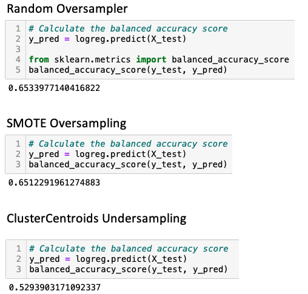

# Credit_Risk_Analysis, Module 17 Challenge

Using the credit card credit dataset from LendingClub, a peer-to-peer lending services company, you’ll oversample the data using the RandomOverSampler and SMOTE algorithms, and undersample the data using the ClusterCentroids algorithm. Then, you’ll use a combinatorial approach of over- and undersampling using the SMOTEENN algorithm. Next, you’ll compare two new machine learning models that reduce bias, BalancedRandomForestClassifier and EasyEnsembleClassifier, to predict credit risk. Once you’re done, you’ll evaluate the performance of these models and make a written recommendation on whether they should be used to predict credit risk.

## Deliverable 1: Use Resampling Models to Predict Credit Risk

For all three algorithms, the following have been completed:
An accuracy score for the model is calculated (7.5 pt)

A confusion matrix has been generated (7.5 pt)

An imbalanced classification report has been generated (15 pt)

## Deliverable 2: Use the SMOTEENN algorithm to Predict Credit Risk

The combinatorial SMOTEENN algorithm does the following:
An accuracy score for the model is calculated (5 pt)

A confusion matrix has been generated (5 pt)

An imbalanced classification report has been generated (5 pt)

## Deliverable 3: Use Ensemble Classifiers to Predict Credit Risk

The BalancedRandomForestClassifier algorithm does the following:
An accuracy score for the model is calculated (2.5 pt)

A confusion matrix has been generated (2.5 pt)

An imbalanced classification report has been generated (5 pt)

The features are sorted in descending order by feature importance (5 pt)

The EasyEnsembleClassifier algorithm does the following:
An accuracy score of the model is calculated (2.5 pt)

A confusion matrix has been generated (2.5 pt)

An imbalanced classification report has been generated (5 pt)

## Deliverable 4: Written Report on the Credit Risk Analysis

Analysis (24 points)

The written analysis has the following:
Overview of the loan prediction risk analysis:
The purpose of this analysis is well defined (4 pt)

Results:
There is a bulleted list that describes the balanced accuracy score and the precision and recall scores of all six machine learning models (15 pt)

Summary:
There is a summary of the results (2 pt)
There is a recommendation on which model to use, or there is no recommendation with a justification (3 pt)