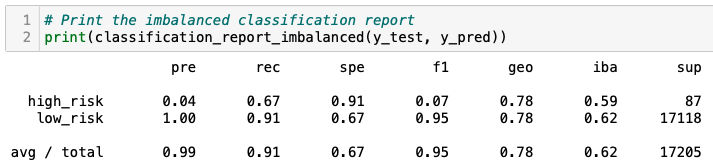

# Credit_Risk_Analysis, Module 17 Challenge

Six machine learning models are evaluated to predict "credit risk". Undersampling, oversampling and a combination of both models are used.

## Deliverable 1: Resampling Models to Predict Credit Risk

### 1.1 Accuracy scores:

### 1.2 Confusion matrices:

### 1.3 Imbalanced classification reports:

## Deliverable 2: SMOTEENN algorithm to Predict Credit Risk

### 2.1 Accuracy score:

### 2.2 Confusion matrix:

### 2.3 Imbalanced classification report:

## Deliverable 3: Ensemble Classifiers to Predict Credit Risk

### 3.1 BalancedRandomForestClassifier

Accuracy score of the model:

Confusion matrix:

Imbalanced classification report:

Features sorted in descending order by feature importance:

As a plot:

### 3.2 EasyEnsembleClassifier algorithm

Accuracy score of the model:

Confusion matrix:

Imbalanced classification report:

## Deliverable 4: Written Report on the Credit Risk Analysis

### Purpose of this analysis

Using the credit card credit dataset provided (LoanStats_2019Q1.csv), the following algorithms will be applied:

* RandomOverSampler (oversample)
* SMOTE (oversample)
* ClusterCentroids (undersample)

After that, a combinatorial approach of "over" and "undersampling", using the SMOTEENN algorithm will be performed. The BalancedRandomForestClassifier and EasyEnsembleClassifier will evaluate the data, to predict credit risk.

### Results

Hereafter is a summary of:

* balanced accuracy scores
* precision (positive predictive value) scores
* recall (sensitivity) scores

for all six machine learning models.

### Summary

1. **Overall Performance:** just looking at the model's performance, without considering any particular risk, the "Accuracy" column shows that the highest score (at 93%) is obtained by the EasyEnsembleClassifier model. And the lowest corresponds to the ClusterCentroids with just 53%.
2. **High Risk:** in this category, the sensitivity is the metric we want to be the highest. The EasyEnsembleClassifier model again outperformed the others, with a score of 91%, followed by the SMOTEENN with only 69%. Worth noting that the Precision (7%) and F1 (14%) scores are also the highest with this model.
3. **Low Risk:** because this data is so imbalanced (99.5% low risk vs. 0.5% high risk), it is not a surprise that every model has a precision of 100% for this class. When it comes to sensitivity and F1 scores, one more time, the EasyEnsembleClassfier tops with 94% and 97% respectively. And the lowest scores in both categories were obtained with the ClusterCentriods model (45% and 62%).

When a highly imbalanced dataset is analyzed, from the six models considered, likely, the EasyEnsembleClassfier will yield the highest score for the smallest class (high-risk credit in this particular case). The EasyEnsembleClassifier model involves creating balanced samples of the training dataset by selecting **all examples from the minority class** and a subset from the majority class; thus its performance with this type of datasets.

Other models need to be evaluated to improve the precision while maintaining, or even increasing the sensitivity of the provided dataset.